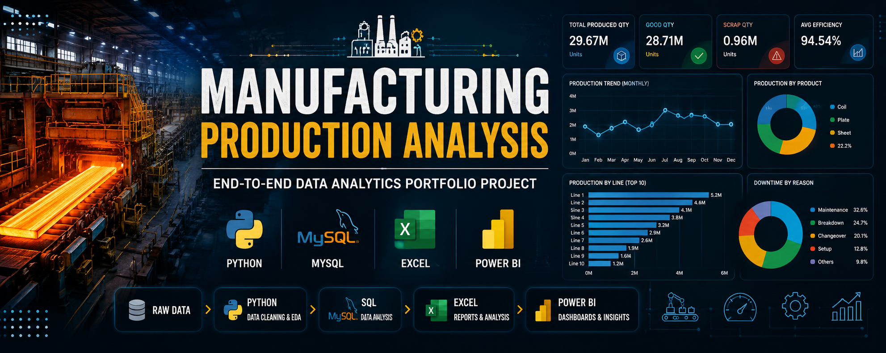
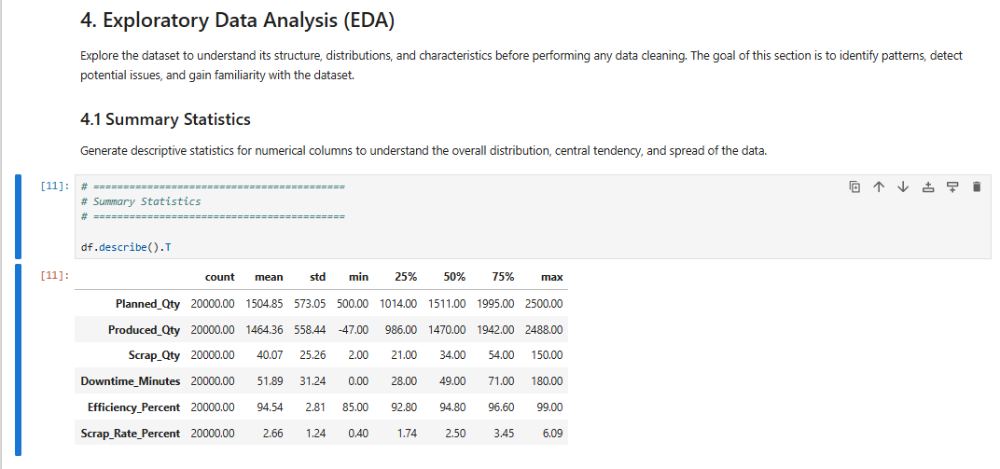
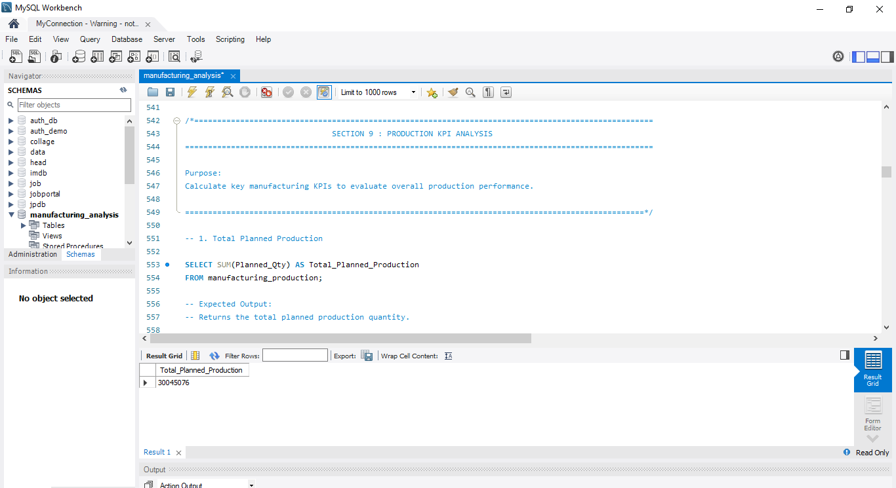
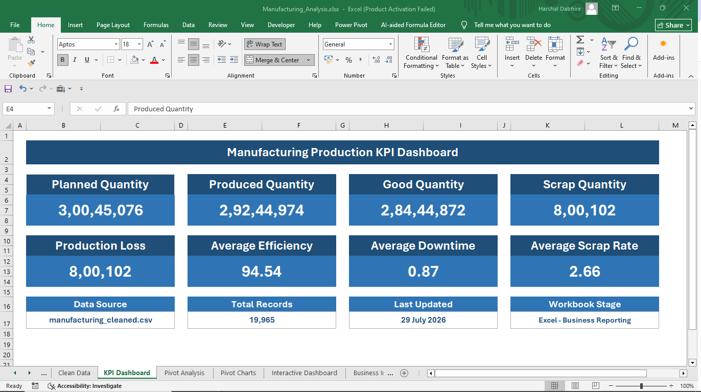
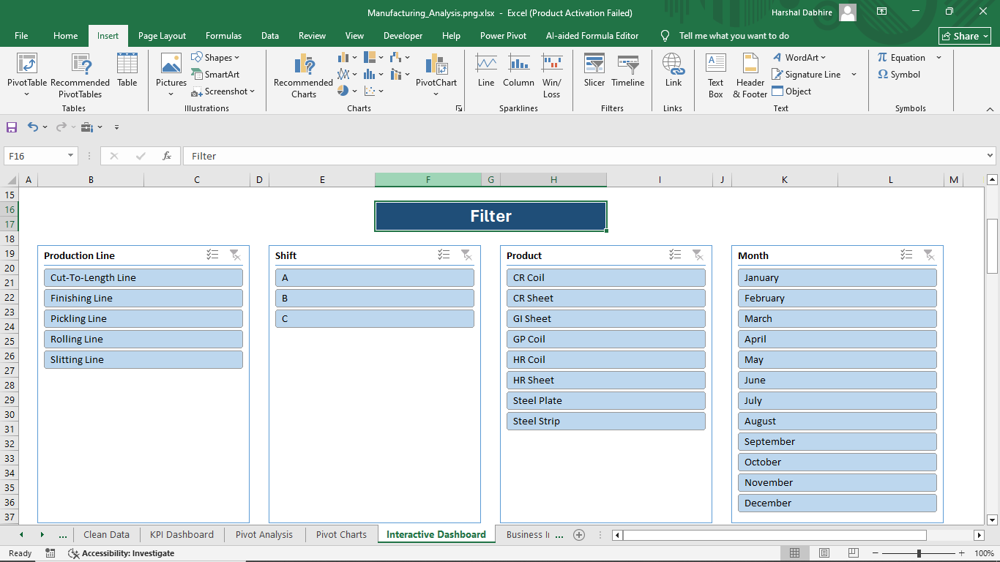
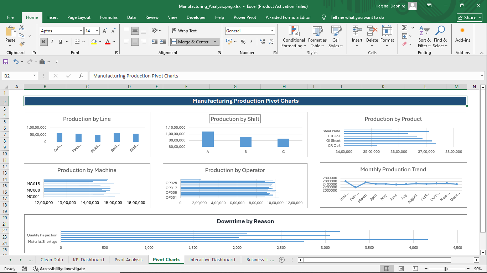
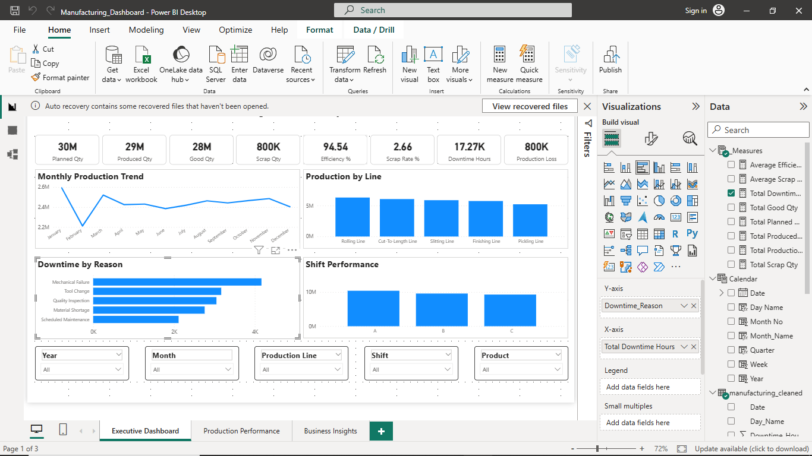
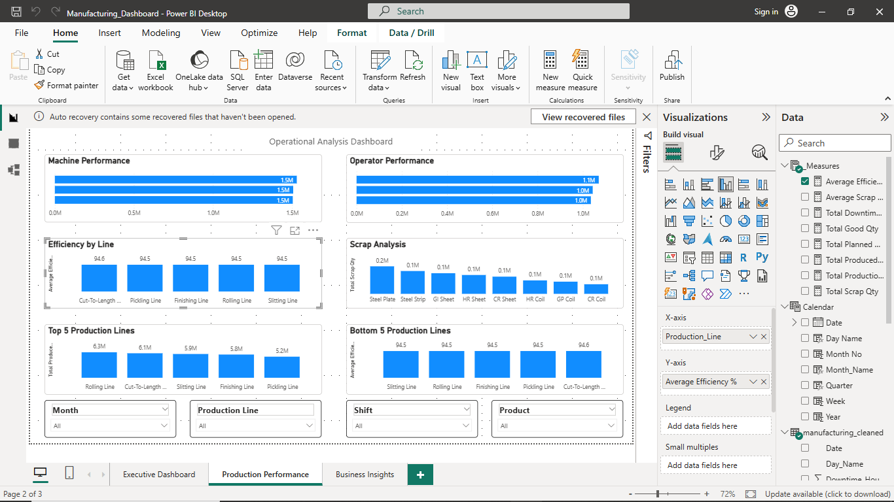
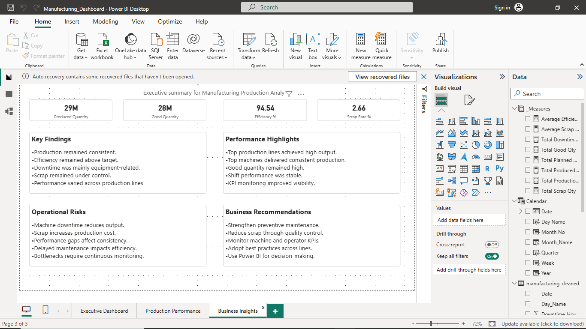

<p align="center">
  
</p>

# Manufacturing Production Analysis

**End-to-End Data Analytics Portfolio Project for Manufacturing / Steel Production**

## Project Overview

This project demonstrates an end-to-end data analytics workflow for a manufacturing production environment using a synthetic dataset generated for portfolio purposes.

The workflow covers data cleaning and feature engineering with Python, business analysis using SQL in MySQL, reporting in Microsoft Excel, and interactive dashboard development in Power BI, transforming raw production data into meaningful business insights.

## Business Problem

Manufacturing organizations generate large volumes of production data every day. However, raw operational data alone does not provide meaningful insights for monitoring production performance, identifying inefficiencies, reducing downtime, or improving overall operational efficiency.

Without a structured analytics process, it becomes difficult to measure key performance indicators (KPIs), evaluate production trends, analyze machine and operator performance, and support data-driven decision-making.

## Business Objective

The objective of this project is to build an end-to-end data analytics solution that transforms raw manufacturing production data into meaningful business insights.

The project applies Python for data preparation, SQL in MySQL for business analysis, Microsoft Excel for reporting, and Power BI for interactive dashboard development, demonstrating a complete analytics workflow from raw data to business intelligence.

## Project Workflow

```text
Manufacturing Dataset Generator (Python)
                │
                ▼
Raw Dataset (manufacturing_data.csv)
                │
                ▼
Python
(Data Cleaning, Validation & Feature Engineering)
                │
                ▼
Processed Dataset (manufacturing_cleaned.csv)
        ┌──────────────┼──────────────┐
        ▼              ▼              ▼
 SQL in MySQL   Microsoft Excel    Power BI
(Business       (Reporting &       (Interactive
 Analysis)       Dashboard)         BI Dashboard)
```

---

## Project Architecture

```text
manufacturing_dataset_generator.py
                │
                ▼
manufacturing_data.csv
                │
                ▼
Python
(Data Cleaning, Validation & Feature Engineering)
                │
                ▼
manufacturing_cleaned.csv
        ┌──────────────┼──────────────┐
        ▼              ▼              ▼
 SQL in MySQL   Microsoft Excel    Power BI
(Business       (Reporting &       (Interactive
 Analysis)       Dashboard)         BI Dashboard)
```

---

## Repository Structure

```text
manufacturing-production-analysis/
│
├── README.md
├── LICENSE
├── .gitignore
├── requirements.txt
│
├── data/
│   ├── generator/
│   │   └── manufacturing_dataset_generator.py
│   ├── raw/
│   │   └── manufacturing_data.csv
│   └── processed/
│       └── manufacturing_cleaned.csv
│
├── python/
│   ├── manufacturing_production_analysis.ipynb
│   └── manufacturing_production_analysis.html
│
├── sql/
│   └── manufacturing_production_analysis.sql
│
├── excel/
│   └── manufacturing_analysis.xlsx
│
├── powerbi/
│   └── manufacturing_dashboard.pbix
│
├── images/
│   ├── project_banner.png
│   ├── workflow.png
│   ├── python.png
│   ├── sql_analysis.png
│   ├── excel_dashboard.png
│   ├── excel_filters.png
│   ├── excel_charts.png
│   ├── powerbi_page1.png
│   ├── powerbi_page2.png
│   └── powerbi_page3.png
│
└── docs/
    └── manufacturing_production_analysis_report.pdf
```

## Dataset Information

The dataset used in this project is a **synthetically generated manufacturing production dataset** created using Python. It simulates real-world production operations in a manufacturing environment and covers key production metrics required for end-to-end business analysis.

### Dataset Overview

| Attribute | Details |
|-----------|---------|
| Dataset Name | Manufacturing Production Dataset |
| Source | Python Dataset Generator (`manufacturing_dataset_generator.py`) |
| Dataset Type | Synthetic |
| Industry | Manufacturing |
| Initial Records | 20,000 |
| Cleaned Records | 19,965 |
| File Format | CSV |
| Raw Dataset | `manufacturing_data.csv` |
| Processed Dataset | `manufacturing_cleaned.csv` |

### Key Dataset Features

- Production planning and actual production quantities
- Product-wise manufacturing records
- Machine and operator information
- Shift-wise production data
- Downtime duration and downtime reasons
- Production efficiency metrics
- Scrap quantity and scrap rate analysis
- Time-based analysis (Month, Quarter, Week, Day)
- Feature engineered business metrics for advanced analytics

> **Note:** The dataset was intentionally generated with missing values, duplicate records, inconsistent text formatting, and invalid values to simulate real-world manufacturing data. These issues were identified and resolved during the Python data cleaning and preprocessing stage.

## Technology Stack

This project demonstrates an end-to-end data analytics workflow using industry-standard tools and technologies.

| Category | Technology |
|----------|------------|
| Programming Language | Python |
| Data Processing | Pandas, NumPy |
| Data Visualization | Matplotlib |
| Database | MySQL |
| SQL IDE | MySQL Workbench |
| Spreadsheet Analysis | Microsoft Excel |
| Business Intelligence | Microsoft Power BI |
| Data Format | CSV |
| Development Environment | Jupyter Notebook |
| Version Control | Git & GitHub |

### Libraries Used

- Pandas
- NumPy
- Matplotlib

### Skills Demonstrated

- Data Cleaning
- Data Validation
- Feature Engineering
- Exploratory Data Analysis (EDA)
- SQL Querying
- Data Aggregation
- KPI Development
- Dashboard Design
- Data Visualization
- Business Intelligence Reporting
- Business Insight Generation
- End-to-End Analytics Workflow

## Project Stages (Overview)

The project follows a structured end-to-end data analytics workflow, starting from dataset generation and ending with interactive business intelligence dashboards.

| Stage | Description | Output |
|-------|-------------|--------|
| **Stage 1** | Generate a realistic manufacturing dataset using Python. | `manufacturing_data.csv` |
| **Stage 2** | Clean, validate, and preprocess the dataset using Python. Perform feature engineering and exploratory data analysis (EDA). | `manufacturing_cleaned.csv` |
| **Stage 3** | Import the cleaned dataset into MySQL and perform business analysis using SQL queries, aggregations, CTEs, window functions, and views. | Business Analysis |
| **Stage 4** | Build interactive reports and dashboards in Microsoft Excel using Pivot Tables, Pivot Charts, KPI Cards, and Slicers. | Excel Dashboard |
| **Stage 5** | Develop an interactive Power BI solution with data modeling, DAX measures, KPI cards, visualizations, and business insights. | Power BI Dashboard |
| **Stage 6** | Document the complete project with workflow, data dictionary, business insights, and project report for GitHub. | Project Documentation |

### Workflow Summary

- Generate a realistic manufacturing dataset.
- Clean and preprocess the raw data using Python.
- Perform business analysis using SQL.
- Create analytical dashboards in Microsoft Excel.
- Build interactive business intelligence dashboards in Power BI.
- Document the complete project for GitHub portfolio presentation.

## Python Summary

Python was used to build the foundation of this project by generating the dataset, performing data cleaning, exploratory data analysis (EDA), feature engineering, and preparing the final dataset for downstream analytics.

### Key Activities

- Generated a realistic manufacturing production dataset.
- Loaded and explored the raw dataset.
- Identified and handled missing values.
- Removed duplicate records.
- Standardized inconsistent text values.
- Corrected invalid and inconsistent data.
- Performed exploratory data analysis (EDA).
- Created new business metrics through feature engineering.
- Calculated production KPIs.
- Exported the cleaned dataset for SQL, Excel, and Power BI analysis.

### Python Libraries Used

- Pandas
- NumPy
- Matplotlib

### Output

- `manufacturing_data.csv` (Raw Dataset)
- `manufacturing_cleaned.csv` (Processed Dataset)

## SQL Summary

MySQL was used to perform business analysis on the cleaned manufacturing dataset by writing SQL queries to extract meaningful insights, calculate KPIs, and analyze production performance.

### Key Activities

- Imported the cleaned dataset into MySQL.
- Performed data exploration using SQL queries.
- Applied filtering and sorting techniques.
- Used aggregate functions for KPI calculations.
- Analyzed production performance by production line, product, shift, machine, and operator.
- Conducted downtime and scrap analysis.
- Performed time-based analysis using monthly and quarterly trends.
- Utilized Common Table Expressions (CTEs) and Window Functions for advanced analytics.
- Created SQL Views for reusable business reporting.

### SQL Concepts Used

- SELECT
- WHERE
- ORDER BY
- GROUP BY
- HAVING
- Aggregate Functions
- CASE Statements
- JOIN Operations
- Common Table Expressions (CTEs)
- Window Functions
- Views

### Output

- Manufacturing business analysis
- KPI calculations
- Performance reports
- SQL script (`Manufacturing_Production_Analysis.sql`)

## Microsoft Excel Summary

Microsoft Excel was used to transform the cleaned manufacturing dataset into an interactive business reporting dashboard using Pivot Tables, Pivot Charts, KPI cards, and slicers.

### Key Activities

- Imported the cleaned dataset into Microsoft Excel.
- Created Pivot Tables for business analysis.
- Developed Pivot Charts for visual reporting.
- Designed KPI cards to monitor key performance indicators.
- Built an interactive dashboard using slicers.
- Analyzed production performance, efficiency, downtime, and scrap.
- Generated business insights from summarized data.

### Excel Features Used

- Pivot Tables
- Pivot Charts
- KPI Cards
- Slicers
- Conditional Formatting
- Excel Formulas

### Dashboard Highlights

- Production Overview
- Shift-wise Performance
- Product-wise Analysis
- Machine-wise Analysis
- Monthly Production Trend
- Downtime Analysis
- Production KPIs

### Output

- Interactive Excel Dashboard
- Manufacturing_Analysis.xlsx

## Power BI Summary

Power BI was used to build an interactive business intelligence solution by transforming the cleaned manufacturing dataset into dynamic dashboards with KPIs, DAX measures, and interactive visualizations.

### Key Activities

- Imported the cleaned dataset into Power BI.
- Created a Calendar table for time-based analysis.
- Built relationships between tables.
- Developed DAX measures for KPI calculations.
- Designed interactive dashboards using charts, KPI cards, and slicers.
- Performed production, efficiency, downtime, and scrap analysis.
- Generated business insights to support decision-making.

### Power BI Features Used

- Data Modeling
- Calendar Table
- DAX Measures
- KPI Cards
- Clustered Bar Charts
- Line Charts
- Slicers
- Interactive Filtering

### Dashboard Pages

- Executive Dashboard
- Production Performance Dashboard
- Business Insights Dashboard

### Output

- Interactive Power BI Dashboard
- Manufacturing_Dashboard.pbix


## Dashboard Preview

### Python - EDA



*Exploratory Data Analysis (EDA) of the manufacturing dataset.*

---

### SQL - Production KPI Analysis



*Production KPI analysis performed using SQL queries.*

---

### Microsoft Excel Dashboard

#### KPI Dashboard



*Key manufacturing performance indicators.*

#### Interactive Filters



*Interactive slicers for dashboard filtering.*

#### Dashboard Charts



*Production performance visualizations using Pivot Charts.*

---

### Power BI - Executive Dashboard



*Executive overview of manufacturing KPIs.*

---

### Power BI - Production Performance Dashboard



*Production performance analysis across multiple business dimensions.*

---

### Power BI - Business Insights Dashboard



*Business insights and key operational findings.*

## Business Insights

- Production efficiency can be effectively monitored using key performance indicators such as planned quantity, produced quantity, good quantity, scrap quantity, and production loss.

- Downtime analysis helps identify major production interruptions, enabling targeted actions to improve operational efficiency.

- Production performance varies across production lines, shifts, machines, operators, and products, highlighting opportunities for performance optimization.

- Monitoring scrap rate and production loss supports quality improvement and waste reduction initiatives.

- Interactive dashboards enable stakeholders to track production trends, compare operational performance, and support data-driven decision-making.

## Installation

1. Clone the repository.

```bash
git clone https://github.com/harshaldabhire/Manufacturing-Production-Analysis.git
```

2. Navigate to the project directory.

```bash
cd Manufacturing-Production-Analysis
```

3. Install the required Python libraries.

```bash
pip install -r requirements.txt
```

## How to Run

1. Run `manufacturing_dataset_generator.py` to generate the synthetic manufacturing dataset (`manufacturing_data.csv`).

2. Open `Manufacturing_Production_Analysis.ipynb` to perform data cleaning, validation, feature engineering, and export the processed dataset (`manufacturing_cleaned.csv`).

3. Execute `Manufacturing_Production_Analysis.sql` in MySQL to perform business analysis and generate analytical insights.

4. Open `Manufacturing_Analysis.xlsx` to explore KPI reporting, Pivot Tables, Pivot Charts, and the interactive Excel dashboard.

5. Open `Manufacturing_Dashboard.pbix` in Power BI Desktop to view the interactive business intelligence dashboards.


## Author

**Harshal Dabhire**

Data Analyst | Python | SQL | Microsoft Excel | Power BI

GitHub: https://github.com/harshaldabhire

LinkedIn: https://www.linkedin.com/in/harshal-dabhire-a077a9137/

## License

This project is licensed under the MIT License. See the [LICENSE](LICENSE) file for more information.

## Acknowledgements

This project was developed as part of my data analytics portfolio to demonstrate an end-to-end analytics workflow using Python, SQL, Microsoft Excel, and Power BI.

Special thanks to the open-source Python community and the developers of Pandas, NumPy, Matplotlib, MySQL, Microsoft Excel, Power BI, Git, and GitHub for providing the tools that made this project possible.

